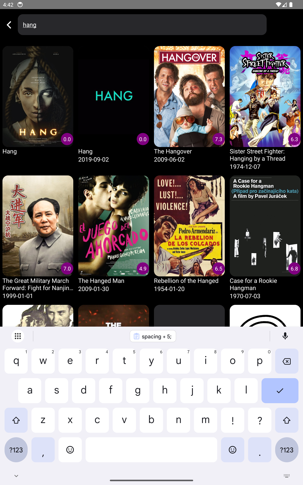

# MovieFlix

A OTT app for curated Movies

## Features

- splash screen
- home screen with categories tab
- categories with pagination
- categories with search option
- all states handled with hooks
- unit tests above 80% for every component
- works for both android and ios
- add to watchlist functinality
- modular custom hooks architecture
- reanimated v3 for scroll and splash animations

# Getting Started

### secrets

- need a token to start the project get the token from
  https://developer.themoviedb.org/reference/movie-now-playing-list
- replace the token placeholder in src/globals/secrets.ts

### For Android

```bash
# using npm
npm run android

# OR using Yarn
yarn android
```

### For iOS

```bash
# using npm
npm run ios

# OR using Yarn
yarn ios
```

## screenshots

<table>
  <tr>
    <td align="center">
      
    </td>
  </tr>
</table>

## Mobile

<table>
  <tr>
    <td align="center">
      
    </td>
    <td align="center">
      
    </td>
    <td align="center">
      
    </td>
  </tr>
  <tr>
    <td align="center">
      
    </td>
    <td align="center">
      
    </td>
    <td align="center">
      
    </td>
  </tr>
  <tr>
    <td align="center">
      
    </td>
    <td align="center">
      
    </td>
    <td align="center">
      
    </td>
  </tr>
  <tr>
    <td align="center">
      
    </td>
  </tr>
</table>

## Tablet

<table>
 <tr>
  <td align="center">
    
  </td>
  <td align="center">
    
  </td>
  <td align="center">
    
  </td>
 </tr>
  <tr>
    <td align="center">
      
    </td>
    <td align="center">
      
    </td>
    <td align="center">
      
    </td>
  </tr>
</table>
